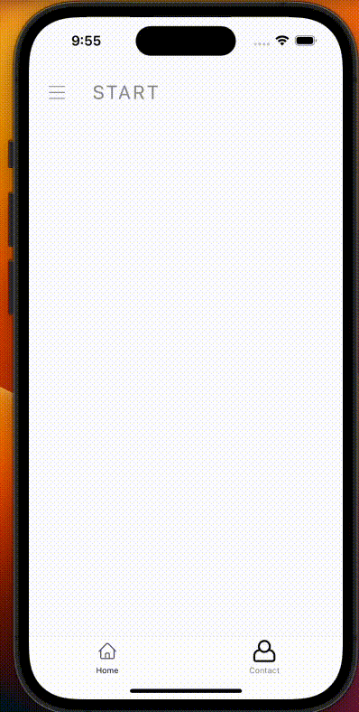
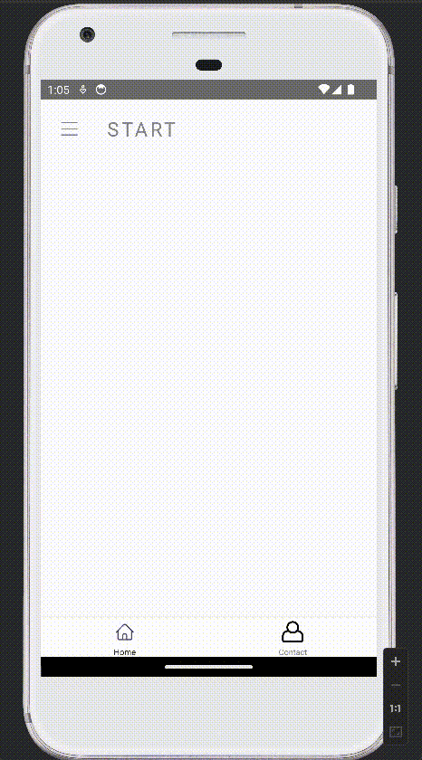

# React Native Custom Drawer App

This is a React Native project built with version 0.73.2, incorporating React Navigation to create a custom drawer for navigation.

## iOS



## Android



## Prerequisites

Before running the project, make sure you have the following installed on your development machine:

- Node.js (version >= 18) [Download Node.js](https://nodejs.org/)
- npm (Node Package Manager, comes with Node.js)
- React Native CLI (install globally via `npm install -g react-native-cli`)

## Step 1: Start the Metro Server

First, you will need to start **Metro**, the JavaScript _bundler_ that ships _with_ React Native.

To start Metro, run the following command from the _root_ of your React Native project:

```bash
# using npm
npm start

# OR using Yarn
yarn start
```

## Step 2: Start your Application

Let Metro Bundler run in its _own_ terminal. Open a _new_ terminal from the _root_ of your React Native project. Run the following command to start your _Android_ or _iOS_ app:

### For Android

```bash
# using npm
npm run android

# OR using Yarn
yarn android
```

### For iOS

```bash
# using npm
npm run ios

# OR using Yarn
yarn ios
```

If everything is set up _correctly_, you should see your new app running in your _Android Emulator_ or _iOS Simulator_ shortly provided you have set up your emulator/simulator correctly.

This is one way to run your app — you can also run it directly from within Android Studio and Xcode respectively.
